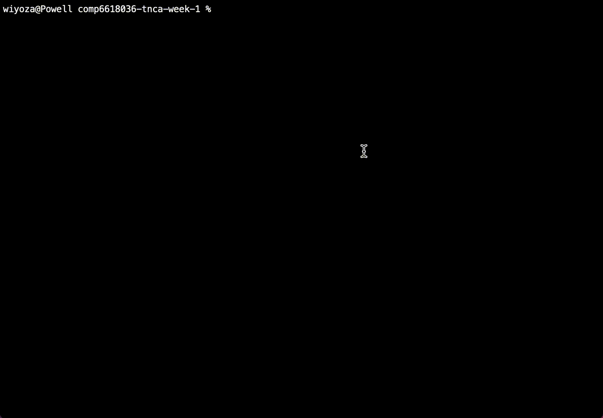

# comp6618036-tnca-week-1

## Getting started
To get started, in the project directory you can build the project by using this command:
```
g++ -std=c++11 main.cc -o main
```
Then you can run the main file using this command:
```
./main
```

## Demo

